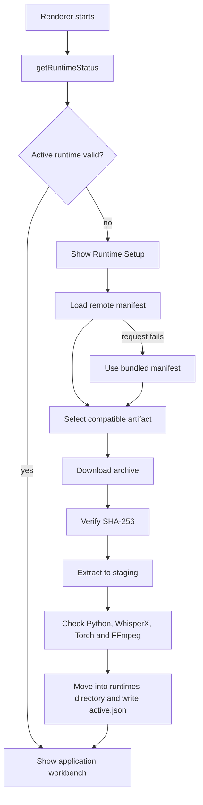
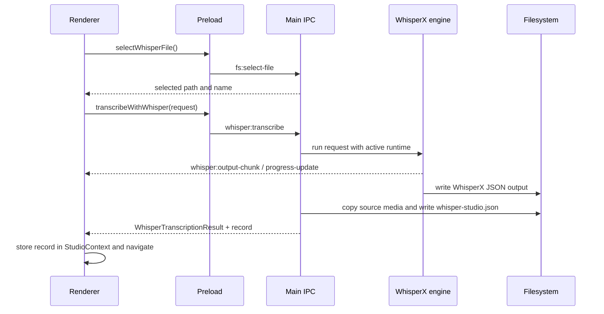

# Architecture

Whisper Studio is an Electron desktop application split into four TypeScript layers: the Electron main process, a sandboxed preload bridge, the React renderer, and shared contracts. Privileged operating-system and runtime work stays in the main process; the renderer reaches it only through the typed `DesktopApi` exposed by preload.

## Process Overview

```text
┌──────────────────────────────────────────────────────────────┐
│ Renderer — React + Vite (`src/renderer/src`)                 │
│                                                              │
│ app shell → features/components → `window.desktop`           │
└──────────────────────────┬───────────────────────────────────┘
                           │ typed `DesktopApi`
                           │ contextBridge (context isolated)
┌──────────────────────────▼───────────────────────────────────┐
│ Preload (`src/preload/index.ts`)                             │
│                                                              │
│ maps API methods and event subscriptions to IPC channels     │
└──────────────────────────┬───────────────────────────────────┘
                           │ ipcRenderer.invoke / on
┌──────────────────────────▼───────────────────────────────────┐
│ Main process (`src/main`)                                    │
│                                                              │
│ lifecycle + local media protocol + IPC handlers              │
│ runtime manager + ASR engines + filesystem/native APIs       │
└──────────────────────────────────────────────────────────────┘
```

The BrowserWindow uses `contextIsolation: true`, `sandbox: true`, and `nodeIntegration: false`. A custom `local-file://` protocol serves local audio and video, including byte-range requests, without exposing Node.js to React. New windows are denied and opened through the system browser; unexpected renderer navigation is blocked.

## Source Layout

```text
src/
├── main/
│   ├── index.ts                     # app lifecycle, BrowserWindow, local-file protocol
│   ├── cache.ts                     # time-scoped cache utility
│   ├── parser.ts                    # WhisperX JSON parser
│   ├── paths.ts                     # output and runtime data directories
│   ├── ipc/
│   │   ├── command.ts               # active-runtime Python discovery
│   │   ├── system-registration.ts   # registers system-domain handlers
│   │   ├── utils.ts                 # command/environment/path helpers
│   │   ├── asr/
│   │   │   ├── index.ts             # registers transcription and record handlers
│   │   │   ├── executor.ts          # engine-agnostic compatibility wrapper
│   │   │   ├── transcription-handlers.ts
│   │   │   └── engines/
│   │   │       ├── registry.ts      # engine selection
│   │   │       ├── types.ts         # engine contract
│   │   │       └── whisperx.ts      # WhisperX process adapter
│   │   └── system/
│   │       ├── app-info-handlers.ts
│   │       ├── fs-handlers.ts
│   │       ├── model-handlers.ts
│   │       ├── record-handlers.ts
│   │       ├── runtime-handlers.ts
│   │       ├── settings-handlers.ts
│   │       ├── systemStatus-handlers.ts
│   │       └── window-controls.ts
│   └── runtime/
│       ├── health.ts                # runtime file and dependency checks
│       ├── manager.ts               # download, verify, install, activate, remove
│       ├── manifest.ts              # remote manifest with bundled fallback
│       ├── paths.ts                 # platform-specific executable paths
│       └── selection.ts             # platform/architecture/accelerator selection
├── preload/
│   └── index.ts                     # exposes `window.desktop`
├── renderer/
│   ├── index.html
│   └── src/
│       ├── main.tsx                 # React entry point
│       ├── app-root.tsx             # shell, runtime gate, providers, error boundary
│       ├── app/                     # routing, navigation, desktop shell, studio context
│       ├── components/              # shared shell and UI components
│       ├── features/                # dashboard, export, models, new transcription,
│       │                            # runtime setup, settings, and studio
│       └── lib/                     # renderer-only adapters, parsers, generators, helpers
└── shared/
    ├── ipc.ts                       # IPC names, payloads, records, and DesktopApi
    ├── types.ts                     # Result<T, E> and helpers
    ├── errors.ts                    # typed domain errors
    └── constants.ts                 # cross-process constants and model catalog
```

Supporting project structure:

```text
resources/                            # packaged icons and runtime manifest
scripts/
├── electron-vite.mjs                # development/preview launcher
├── generate-icons.mjs
└── runtime/                          # runtime bundle and manifest builders
tests/unit/                           # main, renderer, and shared unit tests
runtime-manifest.json                 # runtime artifact manifest source
electron.vite.config.ts               # main/preload/renderer build entries and aliases
package.json                          # scripts and electron-builder configuration
```

Generated directories such as `out/`, `release/`, `runtime-dist/`, and `node_modules/` are not architectural source layers.

## Main Process

`src/main/index.ts` owns application lifecycle, the native window, navigation policy, external links, and the `local-file://` media protocol. At startup it registers two handler groups:

- `registerSystemHandlers()` for app information, system status, model management, runtime management, filesystem access, settings, and window controls.
- `registerWhisperHandlers()` for transcription execution and persisted transcription records.

The main process is the only layer that reads or writes arbitrary files, opens native dialogs, manages runtime files, or spawns Python. Renderer code must not import from `src/main`.

### ASR engine boundary

The transcription handler resolves an engine through `ipc/asr/engines/registry.ts`. Engines implement the `TranscriptionEngine` interface and return a `Result<TranscriptionEngineResult, TranscriptionError>`. WhisperX is currently the only registered engine, but engine selection is represented explicitly in requests and persisted records.

`whisperx.ts` obtains the active managed runtime, launches its Python interpreter with `-m whisperx`, streams stdout/stderr and progress over IPC, and parses the generated JSON. This keeps process details out of both the IPC handler and renderer.

## Managed Runtime

The app no longer installs Python, FFmpeg, Torch, or WhisperX separately through system package managers. They are delivered together as a versioned Whisper Runtime archive.

On shell startup, `useDesktopShell()` requests the runtime status. `app-root.tsx` replaces the normal workbench with the runtime setup feature whenever the state is not `ready`.



Selection filters by platform and CPU architecture. A compatible CUDA artifact is recommended when an NVIDIA driver is detected and meets the artifact's minimum driver version; otherwise the CPU artifact is used. Install progress is emitted through `runtime:install-progress`.

Runtime state lives under Electron's user-data directory. Transcription and model operations use the active runtime's Python interpreter rather than a system Python installation.

## Transcription and Editing Flow



The full workflow is:

1. The new-transcription feature selects a media file and collects model, language, compute, diarization, prompt, and export preferences.
2. The main process runs the selected ASR engine using the active runtime. WhisperX currently produces JSON; requested export formats are generated later in the renderer.
3. The transcription handler copies the source media into the output folder when possible and writes `whisper-studio.json` beside the engine output.
4. The completed record is placed in `StudioContext`, then the renderer navigates to Studio or Export.
5. Studio edits update the record's segments and speaker names. Saving rewrites `whisper-studio.json` through `fs:write-text-file`.
6. Export converts segments to SRT, VTT, TXT, or TSV in `lib/export-generators.ts` and writes the selected files through the preload API.

The dashboard reconstructs the library by asking the main process to scan output subdirectories for `whisper-studio.json`. Opening a dashboard record uses the same `StudioContext` handoff. The context is intentionally in-memory: durable state remains in each transcription directory.

## Renderer

`app-root.tsx` composes the title bar, sidebar, status bar, runtime gate, error boundary, routing, and `StudioProvider`. Hash-based routing selects feature roots through `app/app-route-view.tsx`.

Renderer responsibilities are divided as follows:

- `app/` owns application-wide routing, navigation, shell state, and cross-feature Studio state.
- `components/` owns reusable shell components and UI primitives.
- `features/` owns product workflows and their local components/hooks.
- `lib/` owns renderer-only API wrappers, parsing, export generation, formatting, and utilities.

Most feature roots are `features/<name>/index.tsx`; settings uses `settings-page.tsx`. Feature-specific components and hooks remain under that feature. Native access must go through the smallest applicable `DesktopApi` sub-interface.

## Preload and Shared Contracts

`src/preload/index.ts` is the only bridge between Electron APIs and React. It composes focused API objects, maps their methods to `IPC_CHANNELS`, wraps event listeners with unsubscribe functions, and exposes the result as `window.desktop`.

`src/shared` must remain usable by all three processes. `ipc.ts` is the source of truth for channel constants, request/response payloads, runtime and transcription records, and the renderer-facing API.

`DesktopApi` is the intersection of six focused interfaces:

| Interface | Responsibility |
| --- | --- |
| `AppApi` | App/platform/system information, runtime lifecycle and progress, native file-path extraction |
| `ModelApi` | Downloaded model discovery, download/delete actions, progress events |
| `TranscriptionApi` | Media selection, transcription, output/progress events, record list/delete |
| `FileSystemApi` | Text-file reads/writes and directory selection |
| `WindowControlsApi` | Native window state and controls |
| `SettingsApi` | Persisted settings, update checks, and external links |

Use `Result<T, E>` from `shared/types.ts` for internal operations with expected failure paths. IPC handlers translate those results into serializable response contracts for the renderer.

## IPC Namespaces

All channel names are defined in `src/shared/ipc.ts` and follow `namespace:action`.

| Namespace | Purpose |
| --- | --- |
| `app:` | Application metadata and update checks |
| `system:` | Platform and hardware/runtime readiness summary |
| `runtime:` | Runtime manifest, status, install, activation, removal, folder, and progress |
| `models:` | Whisper model discovery, download, deletion, and progress |
| `window:` | Native window actions and state events |
| `whisper:` | Transcription requests, process output, and progress |
| `transcriptions:` | Persisted record listing and deletion |
| `fs:` | File selection and text/directory filesystem operations |
| `settings:` | User preference reads and writes |
| `shell:` | Opening approved external URLs |

## Persistence and Paths

- Default transcriptions: Electron Documents / `Whisper Studio/transcriptions`, overridable through settings.
- Runtime installations and `active.json`: Electron user-data / `runtimes`.
- Downloaded models: Hugging Face hub cache (`HF_HUB_CACHE` or the standard user cache).
- Settings: JSON under Electron's user-data directory.
- Each transcription directory contains `whisper-studio.json`, generated WhisperX JSON, and normally a copy of the source media.

## Build, Test, and Packaging

Electron Vite builds three entries: CommonJS bundles for main and preload, plus the Vite React renderer. `@` and `@renderer` resolve to the renderer source and `@shared` resolves to `src/shared`.

Useful validation commands are:

```text
npm run typecheck
npm run lint
npm test
npm run build
```

Electron Builder packages `out/`, `resources/`, and `package.json`. Compiled application code goes to `out/`; installers and unpacked distributions go to `release/`. Runtime archives are built separately by `scripts/runtime/` and published artifacts are described by the runtime manifest.
